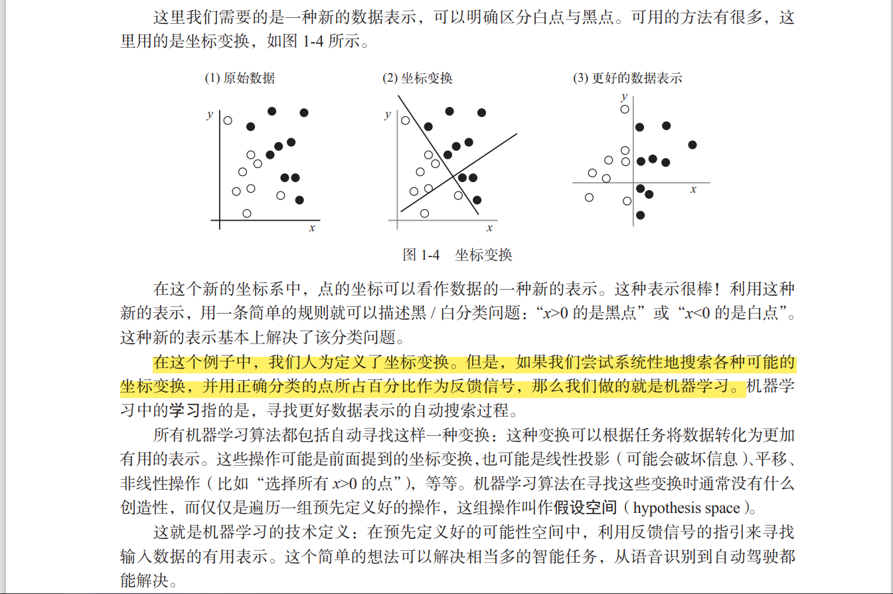
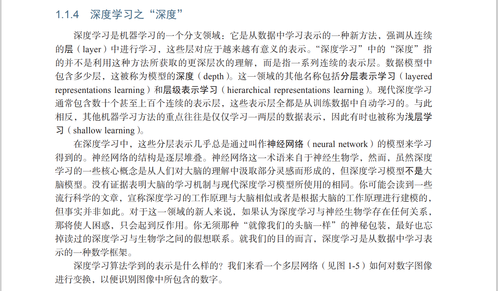

这是一门需要上手实践的学科，想法更多地是靠实践来证明，而不是靠理论推导。

机器学习和深度学习的核心问题在于有意义地变换数据

### 学习的概念
机器学习中的学习指的是，寻找更好数据表示的自动搜索过程。

这种变化指的是预处理吗？
不是，这里指的学习的概念。这里为了说明机器学习与其下深度学习的区别，就先说明了学习的概念，把数据变化为更好的数据展示，这就是机器学习领域中的学习，所以预先编写好变化也算机器学习，而让机器自动生成这种变化，就是深度学习，方案就是使用数据集来让机器学习

在深度学习中，这些分层表示几乎总是通过叫作神经网络（neural network）的模型来学习 得到的。
这样说，训练模型的流程是不是就是在生成这些层，而验证模型准确性的时候就是数据在通过这些层

深度学习的技术定义：学习数据表示的多级方法
也就是说一个模型能够对数据的所有表示都进行正确、合理的变化，那这个模型就越成功